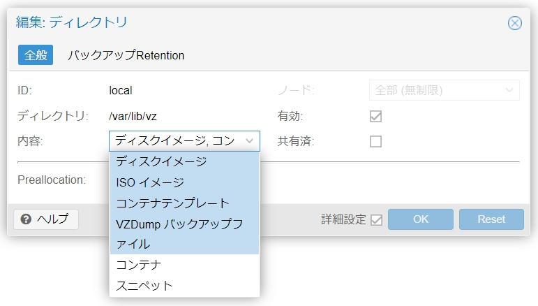

# Proxmox に cloud-init テンプレートを作成する

## 1 はじめに

Proxmox のスナップショット機能を使いたいために、`local`ストレージ上に cloud-init のストレージを配置しています。  
デフォルトではディスクイメージを配置できないため、設定を変更します。



## 2 準備

<details open>
<summary>カスタマイズされたものを使用</summary>

```bash
curl -O https://github.com/mu-ruU1/docker-kubernetes-tutorial/releases/download/v1/ubuntu-custom-cloudimg.img -L
```
</details>

<details>
<summary>ローカルでカスタマイズ</summary>

[Ubuntu Cloud Images](https://cloud-images.ubuntu.com/)を使用しています。   
ディスクイメージに`QEMUゲストエージェント`をインストールする。

```bash
sudo apt install libguestfs-tools -y
```

```bash
curl -O https://cloud-images.ubuntu.com/jammy/current/jammy-server-cloudimg-amd64.img -L
```

```bash
sudo virt-customize \
  -a jammy-server-cloudimg-amd64.img \
  --install qemu-guest-agent \
  --timezone Asia/Tokyo \
  --edit '/etc/ssh/sshd_config:s/PasswordAuthentication no/PasswordAuthentication yes/'
```

```bash
mv jammy-server-cloudimg-amd64.img ubuntu-custom-cloudimg.img
```
</details>

## 3 テンプレートの作成

Proxmox クラスタまたはホストのシェルで以下を実行する

```bash
qm create 9000 --name ubuntu2204-cloud-img --memory 2048 --net0 virtio,bridge=vmbr0 --agent 1
```

```bash
qm importdisk 9000 ubuntu-custom-cloudimg.img local --format qcow2
```

```bash
qm set 9000 --scsihw virtio-scsi-pci --scsi0 local:9000/vm-9000-disk-0.qcow2
```

```bash
qm set 9000 --ide2 local:cloudinit
```

```bash
qm set 9000 --boot c --bootdisk scsi0
```

```bash
qm template 9000
```

Next> [Terraform の Proxmox ユーザーとロールの作成](./terraform.md#3-terraform-の-proxmox-ユーザーとロールの作成)

## 参考

- [Cloud-Init Support](https://pve.proxmox.com/wiki/Cloud-Init_Support) (公式 wiki)
- [Proxmox Import And Use Cloud Images](https://codingpackets.com/blog/proxmox-import-and-use-cloud-images/)
